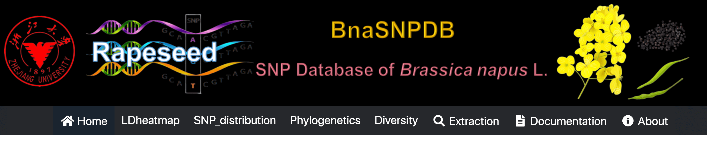

## BnaSNPDB: SNP Database of *Brassica napus* L. 



## Overview

The SNP database of *Brassica napus* (**BnaSNPDB**) is an interactive web portal that provides multiple analysis modules to visualize and explore SNPs among 1007 rapeseed germplasm accessions based on the data reported by previous research ([Wu et al., 2019](http://rapeseed.zju.edu.cn/pdf/mp.pdf)). The app is deployed at https://bnapus-zju.com/bnasnpdb and https://cropdata.shinyapps.io/bnasnpdb for online use. 


**BnaSNPDB** is idle until you activate it by accessing the [URL](https://bnapus-zju.com/bnasnpdb) and [Here](https://cropdata.shinyapps.io/bnasnpdb). So it may take some time to load for the first time. Once it was activated, **BnaSNPDB** could be used smoothly and easily.

The portal is built entirely in **R** and **Shiny** using the **RStudio** development environment.

## Install

### Requirements

* R: https://www.r-project.org/ v4.0.0+
* RStudio: https://rstudio.com/products/rstudio/download
* Shiny Server: https://rstudio.com/products/shiny/download-server (only required for deploying **BnaSNPDB** on web linux server)

### Initialize app

#### To run the app locally:

1. Clone this repository

```
git clone https://github.com/YTLogos/BnaSNPDB.git
```

> The repository is large so it may need some time to finish it.

2. Open `BnaSNPDB.Rproj`

3. Install packages. In the RStudio console, run:

```
# try an http CRAN (Bioc) mirror if https CRAN (Bioc) mirror doesn't work
# First install Bioconductor
if (!requireNamespace("BiocManager", quietly = TRUE))
    install.packages("BiocManager")
BiocManager::install(version = "3.14")

BiocManager::install("shiny",update = F)
BiocManager::install("ggplot2",update = F)
BiocManager::install("stringr",update = F)
BiocManager::install("dplyr",update = F)
BiocManager::install("tidyr",update = F)
BiocManager::install("forcats",update = F)
BiocManager::install("patchwork",update = F)
BiocManager::install("glue",update = F)
BiocManager::install("ggpubr",update = F)
BiocManager::install("writexl",update = F)
BiocManager::install("snpStats"),update = F
BiocManager::install("IRanges",update = F)
BiocManager::install("LDheatmap",update = F)
BiocManager::install("ape",update = F)
BiocManager::install("pegas",update = F)
BiocManager::install("gridExtra",update = F)
BiocManager::install("grid",update = F)
BiocManager::install("ggtree",update = F)
BiocManager::install("shinycssloaders",update = F)
BiocManager::install("shinydashboard",update = F)
BiocManager::install("shinydisconnect",update = F)
BiocManager::install("shinyWidgets",update = F)
BiocManager::install("gggenes",update = F)
BiocManager::install("DT",update = F)
BiocManager::install("shinythemes",update = F)
BiocManager::install("NAM",update = F)
BiocManager::install("adegenet",update = F)

if (!require(devtools)) install.packages("devtools")#if not already installed
devtools::install_github("AnalytixWare/ShinySky")
```

> This may take some time to complete - walk away from your computer, rest your eyes, and catch up on those stretching exercises you are meant to be doing :)

4. Start tha app by running

```
shiny::runApp(launch.browser = TRUE)
```

#### Deploy BnaSNPDB on web Linux server

1. Clone/Upload this repository into /srv/shiny-server

```
$ cd /srv/shiny-server
git clone https://github.com/YTLogos/BnaSNPDB.git
# Or clone it locally and upload the directory to /srv/shiny-server using scp or other tools 
```

2. Configure Shiny Server (/etc/shiny-server/shiny-server.conf)

```
# Instruct Shiny Server to run applications as the user "shiny"
preserve_logs true;
sanitize_errors false;
run_as shiny;

# Define a server that listens on port 3838
server {
  listen 3838;

  # Define a location at the base URL
  location / {

    # Host the directory of Shiny Apps stored in this directory
    site_dir /srv/shiny-server;

    # Log all Shiny output to files in this directory
    log_dir /var/log/shiny-server;

    # When a user visits the base URL rather than a particular application,
    # an index of the applications available in this directory will be shown.
    directory_index on;
  }
}
```

3. Change the owner of the **BnaSNPDB** directory

```
$ chown -R shiny /srv/shiny-server/BnaSNPDB  
```

4. Start Shiny-Server

```
$ start shiny-server
```

Now you can access the **BnaSNPDB** app at http://IPAddressOfYourServer:3838/BnaSNPDB.

